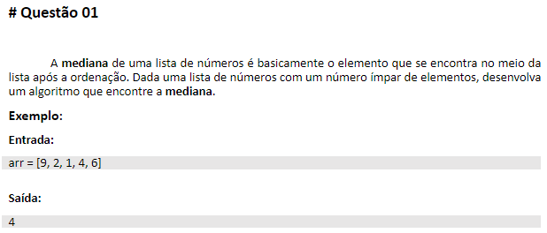
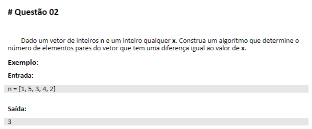
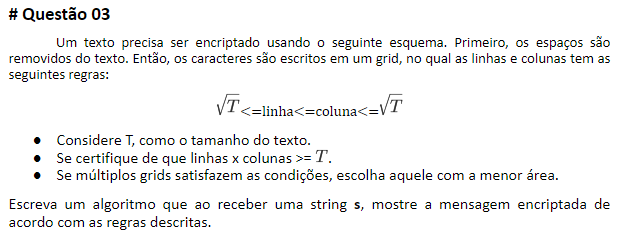

<h1 align="center">
    
</h1>

# Sobre

## DESAFIO DE PROGRAMAÇÃO 02 - ACADEMIA CAPGEMINI

Página do repositório de implementação das questões do Desafio de Programação 2, da Academia Capgemini, edição 2022.

Você pode conhecer mais sobre a **ACADEMIA Capgemini** clicando [aqui](https://capgemini.proway.com.br/).

Clique [aqui](https://github.com/jobafi/challenge-capgemini-2022) para baixar os códigos das questãos.

## Orientações para execução dos códigos

### <Enunciado 1>
  

Para ver o resultado da implementação desta questão, siga os passos abaixo:
1. Baixe o arquivo *"questaoUm.html"*;
2. Em seguida, vá até a pasta onde está o arquivo baixado;
3. Selecione o arquivo desejado, clique no botão direito do mouse, vá em **Abrir com** e selecione o Browser de sua preferência. Sugestão: *Google Chrome*.

O mesmo procedimento vale para executar o arquivo *"testeQuestaoUm.html"*.

***

### <Enunciado 2>
  

Para ver o resultado da implementação desta questão, siga os passos abaixo:
1. Baixe o arquivo *"questaoDois.html"*;
2. Em seguida, vá até a pasta onde está o arquivo baixado;
3. Selecione o arquivo desejado, clique no botão direito do mouse, vá em **Abrir com** e selecione o Browser de sua preferência. Sugestão: *Google Chrome*.

O mesmo procedimento vale para executar o arquivo *"testeQuestaoDois.html"*.

***

### <Enunciado 3>
  

Para ver o resultado da implementação desta questão, siga os passos abaixo:
1. Baixe o arquivo *"questaoTres.html"*;
2. Em seguida, vá até a pasta onde está o arquivo baixado;
3.  Selecione o arquivo desejado, clique no botão direito do mouse, vá em "Abrir com" e selecione o Browser de sua preferência. Sugestão: *Google Chrome*.
4. Ao abrir, clique na tecla **F12**, vá até a opção **Console** e verá a mensagem encryptada. Geralmente a janela aparecerá do lado direito do seu navegador. Uma outra opção para visualizar a mensagem é clicando no botão direito do mouse e selecionando **Inspecionar**. Há ainda a opção de ir em **Mais Ferramentas** (três pontinhos do lado superior direito) e selecionando **Ferramentas de desenvolvedor**. 

O mesmo procedimento vale para executar o arquivo *"testeQuestaoTres.html"*.

***

## Importante
Implementações realizadas em JavaScript. Porém, as chamadas para execução dos códigos de cada questão foram feitas dentro dos respectivos aquivos HTML. Para cada questão encontra-se um arquivo de teste correspondente, também em HTML.

## Tecnologias usadas:
* [HTML](https://developer.mozilla.org/pt-BR/docs/Web/HTML)
* [JavaScript](https://developer.mozilla.org/pt-BR/docs/Web/JavaScript)
* [Markdown](https://daringfireball.net/projects/)

## Ferramentas:
* [Visual Studio Code](https://code.visualstudio.com/)
* [Git](https://git-scm.com/)

## Recursos utilizados:
* [GitHub](https://github.com/)

## Licença:
Este projeto está licenciado sob a licença MIT - consulte a página [LICENÇA](https://opensource.org/licenses/MIT) para obter detalhes.
